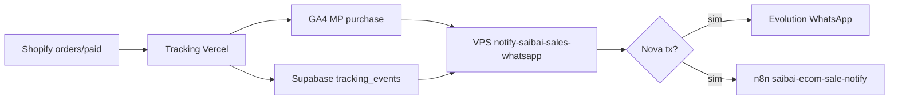

# Empório Saibai — Notificações E-commerce · n8n

**Atualizado:** 2026-06-25  
**Stack:** Shopify · GA4 `G-VWX77SGD1W` · Supabase `vlqxrmejvkxnlmpqhkvt` · Evolution WhatsApp

## Visão geral

Duas camadas complementares:

| Camada | Função | Quando ativa |
|--------|--------|--------------|
| **VPS cron** | Poll GA4/Supabase · dedup · WhatsApp direto | Pós gate B (purchase validado) |
| **n8n webhook** | Recebe evento normalizado · WhatsApp + log | Import + env configurados |

## Workflows n8n

**Status:** ✅ **LIVE** (25/06/2026) · destinatário `5517991661332` · [Notion 06](https://app.notion.com/p/38a968afab66812abdecf99e6e608fc5)

Importar/atualizar via:

```bash
bash docs/agents/scripts/deploy-saibai-n8n.sh
```

| Arquivo | Webhook path | Função |
|---------|--------------|--------|
| `n8n-saibai-ecom-sale-notify.json` | `saibai-ecom-sale-notify` | ✅ ACTIVE `A5gLX8OsP6cHjt4o` |
| `n8n-saibai-shopify-order-paid.json` | `saibai-shopify-order-paid` | ✅ ACTIVE `qcNWhnAEsaipS5my` |
| `n8n-saibai-growth-sheet-sync.json` | `saibai-growth-sheet-sync` | ✅ ACTIVE `qhkj95bVNCYliIIZ` (stub) |

### Ativação n8n

1. Import JSON → revisar credenciais Google Sheets (growth sync)
2. Configurar env n8n:

| Variável n8n | Valor |
|--------------|-------|
| `SAIBAI_ECOM_WEBHOOK_TOKEN` | token shared com VPS |
| `SAIBAI_SHOPIFY_WEBHOOK_TOKEN` | opcional · mesmo ou separado |
| `SAIBAI_SALES_WHATSAPP` | destinos e-com · ex: `5517991661332` |
| `SAIBAI_ALERT_WHATSAPP_LIST` | fallback ops |
| `EVOLUTION_API_KEY` | já no n8n Veltrus |
| `EVOLUTION_INSTANCE_NAME` | `veltrus-agent` |
| `SAIBAI_GROWTH_SHEET_TOKEN` | header sync planilha |

3. Ativar workflows **após** teste com payload sample
4. Copiar URL produção: `https://n8n.ehos.com.br/webhook/saibai-ecom-sale-notify`

## Fluxo venda e-com (recomendado pós go-live)



### Caminho A — Poll VPS (padrão Bautech)

`notify-saibai-sales-whatsapp.mjs`:

- Primário: GA4 Data API `purchase` + `transactionId`
- Fallback: Supabase REST `tracking_events` · `event_name=purchase`
- Dedup: `/opt/veltrus-scripts/saibai-sales-notified.json`
- Primeira execução do dia: marca pedidos existentes **sem enviar** (anti-flood)

Cron: `*/10 7-23 * * *`

### Caminho B — Webhook n8n direto

Forwarding opcional do app Saibai Tracking ou do script VPS:

```bash
curl -X POST https://n8n.ehos.com.br/webhook/saibai-ecom-sale-notify \
  -H "Content-Type: application/json" \
  -H "X-Veltrus-Token: $SAIBAI_ECOM_WEBHOOK_TOKEN" \
  -d '{"order_id":"12345","order_number":"1001","revenue":89.90,"utm_source":"google/cpc"}'
```

### Caminho C — Shopify webhook nativo

Quando app tracking reinstalado com `read_orders`:

- Configurar forward para `https://n8n.ehos.com.br/webhook/saibai-shopify-order-paid`
- Header `X-Veltrus-Token: $SAIBAI_SHOPIFY_WEBHOOK_TOKEN`

## Payload contrato (e-com sale notify)

```json
{
  "order_id": "5678901234",
  "order_number": "1001",
  "revenue": 129.9,
  "currency": "BRL",
  "utm_source": "google/cpc",
  "source": "poll"
}
```

## Mensagem WhatsApp (venda)

```
Emporio Saibai · NOVA VENDA
Pedido: 1001
Valor: R$ 129,90
Canal: google/cpc
Fonte deteccao: ga4
Detectado: 25/06/2026, 14:30:00

Tracking: G-VWX77SGD1W · Shopify emporiosaibai.com.br
```

## Bloqueios atuais (25/06)

| Item | Status | Impacto |
|------|--------|---------|
| GA4 property MCP | PENDING_ACCESS | Poll GA4 falha até `SAIBAI_GA4_PROPERTY_ID` |
| Pagamentos Shopify | Pendente | Sem vendas reais |
| Webhook app | Pendente reinstall | Caminho C inativo |
| Growth sheet ID | PENDING_CREATE | Sync stub only |

## Deploy

```bash
# Scripts + cron VPS
bash docs/agents/scripts/deploy-saibai-campaign-alerts.sh

# n8n — import manual dos 3 JSON em clients/saibai/n8n/
```

## Referências

- Alertas campanha: [CAMPANHA-ALERTAS-WHATSAPP.md](./CAMPANHA-ALERTAS-WHATSAPP.md)
- Go-live gates: [GO-LIVE-RUNBOOK-P0.md](./GO-LIVE-RUNBOOK-P0.md)
- Growth Pack: [GROWTH-SHEET-AUTOMATION.md](./GROWTH-SHEET-AUTOMATION.md)
- Config IDs: `docs/agents/scripts/saibai-config.mjs`
